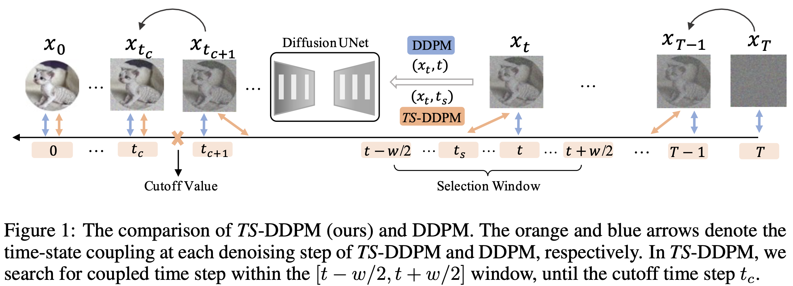

# Alleviating Exposure Bias in Diffusion Models through Sampling with Shifted Time Steps

This is the official implementation (ADM ver.) of [Alleviating Exposure Bias in Diffusion Models through Sampling with Shifted Time Steps](https://arxiv.org/abs/2305.15583) 

by [Mingxiao Li*](https://scholar.google.com/citations?user=0t2f7joAAAAJ&hl=en), [Tingyu Qu*](https://scholar.google.com/citations?user=d18-zLYAAAAJ&hl=en), Ruicong Yao, Wei Sun, Marie-Francine Moens. International Conference on Representation Learning 2024 (ICLR'24).


The codebase is heavily based on [ADM-IP(ICML23)](https://github.com/forever208/DDPM-IP.git). For the codebase with DDPM backbone, please visit [this repo](https://github.com/Mingxiao-Li/TS-DPM).

## Abstract

Denoising Diffusion Probabilistic Models (DDPM) have shown remarkable efficacy in the synthesis of high-quality images. However, their inference process characteristically requires numerous, potentially hundreds, of iterative steps, which could lead to the problem of exposure bias due to the accumulation of prediction errors over iterations. Previous work has attempted to mitigate this issue by perturbing inputs during training, which consequently mandates the retraining of the DDPM. In this work, we conduct a systematic study of exposure bias in diffusion models and, intriguingly, we find that the exposure bias could be alleviated with a new sampling method, without retraining the model. We empirically and theoretically show that, during inference, for each backward time step and corresponding state , there might exist another time step which exhibits superior coupling with . Based on this finding, we introduce an inference method named Time-Shift Sampler. Our framework can be seamlessly integrated with existing sampling algorithms, such as DDIM or DDPM, inducing merely minimal additional computations. Experimental results show that our proposed framework can effectively enhance the quality of images generated by existing sampling algorithms.


## Illustration of our method



## Installation
the installation is the same with [guided-diffusion](https://github.com/openai/guided-diffusion)
```
git clone https://github.com/tingyu215/TS-DPM-ADM.git
cd DDPM-IP
conda create -n ADM python=3.8
conda activate ADM
pip install -e .
(note that, pytorch 1.10~1.13 is recommended as our experiments in paper were done with pytorch 1.10 and pytorch 2.0 has not been tested by us in this repo)

# install the missing packages
conda install mpi4py
conda install numpy
pip install Pillow
pip install opencv-python
```

## Download pre-trained models

Please refer to the [ADM-IP](https://github.com/forever208/DDPM-IP.git) repo.


## Prepare datasets
Please refer to [README.md](https://github.com/forever208/DDPM-IP/tree/DDPM-IP/datasets) for the data preparation.


## Sampling from pre-trained ADM-IP models

To unconditionally sample from these models, you can use the `image_sample_1gpu.py` scripts.
<!-- Sampling from DDPM-IP has no difference with sampling from `openai/guided-diffusion` since DDPM-IP does not change the sampling process. -->

For example, we sample 50k images from CIFAR10 by: 
```
python scripts/image_sample_1gpu.py --image_size 32 --timestep_respacing ddim5 --model_path PATH_TO_CHECKPOINT --num_channels 128 --num_head_channels 32 --num_res_blocks 3 --attention_resolutions 16,8 --resblock_updown True --use_new_attention_order True --learn_sigma True --dropout 0.3 --diffusion_steps 1000 --noise_schedule cosine --use_scale_shift_norm True --batch_size 512 --num_samples 50000 --use_ddim True --do_time_shift True --cutoff 300 --window 80 --out_dir OUTPUT_DIR --data_type cifar10 --model_type adm
```

* *--do_time_shift*: Apply our TS-DPM sampler. Changing it to False enables the original DDIM/DDPM sampling.
* *--cutoff*: Cutoff value to stop time shifting.
* *--window*: The size of the window, within which we search for best coupled time step.


## Citation
If you find our work useful, please feel free to cite by
```
@article{li2023alleviating,
  title={Alleviating Exposure Bias in Diffusion Models through Sampling with Shifted Time Steps},
  author={Mingxiao Li and Tingyu Qu and Ruicong Yao and Wei Sun and Marie-Francine Moens},
  journal={International Conference on Learning Representations},
  year={2024}
}
```
